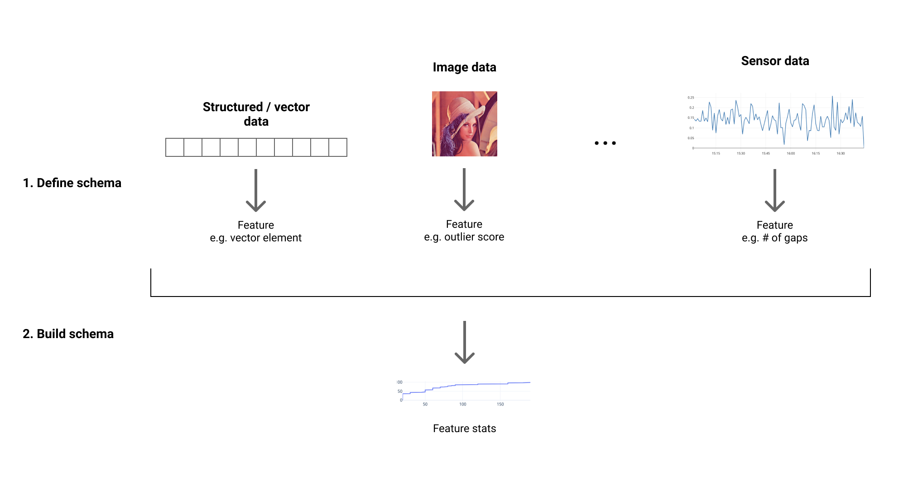
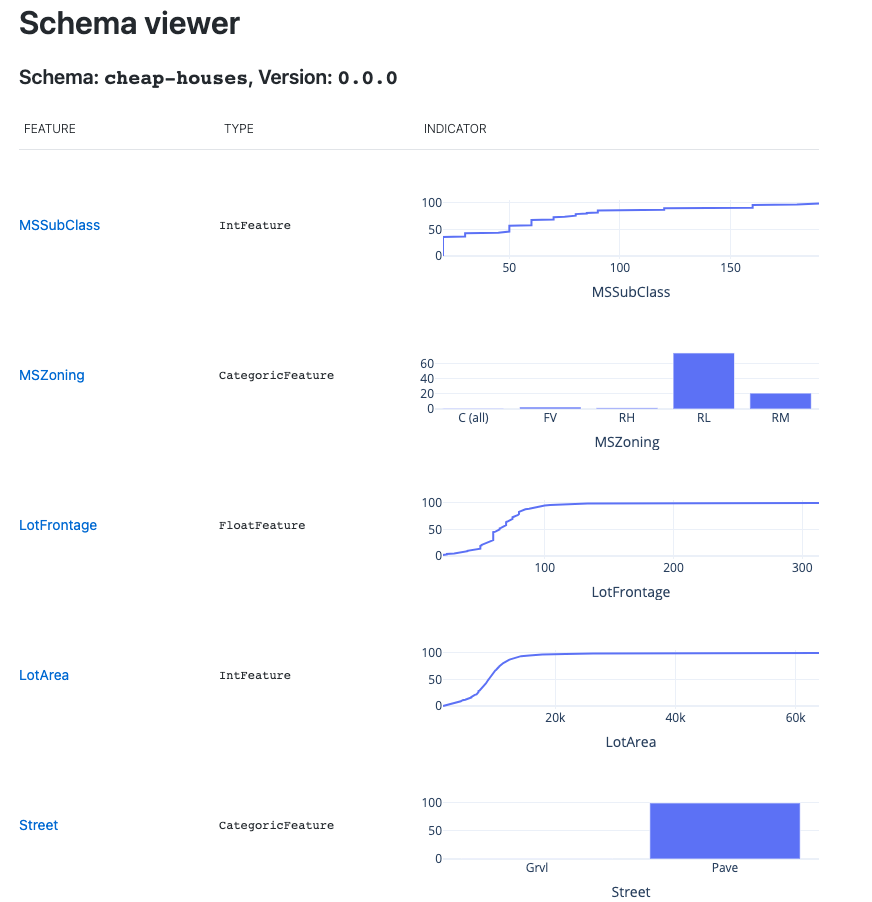
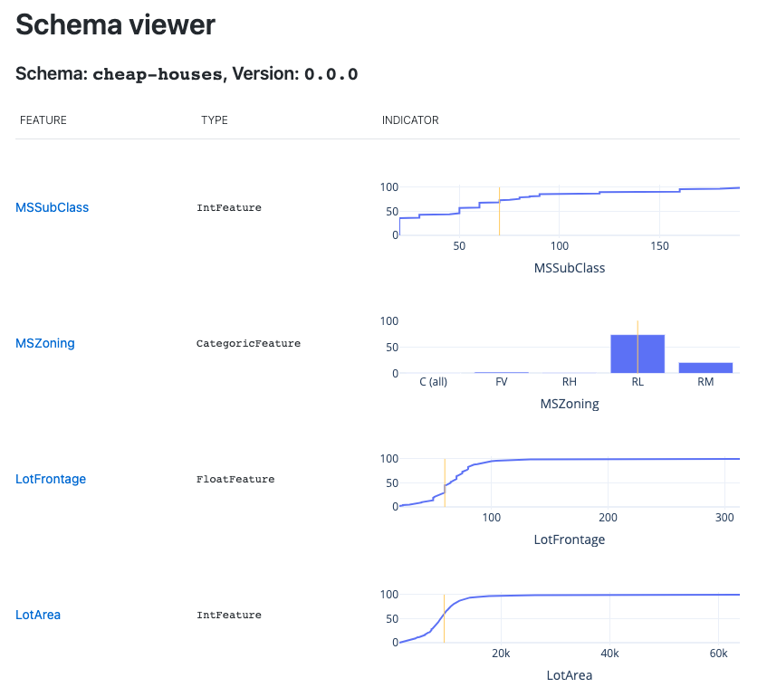
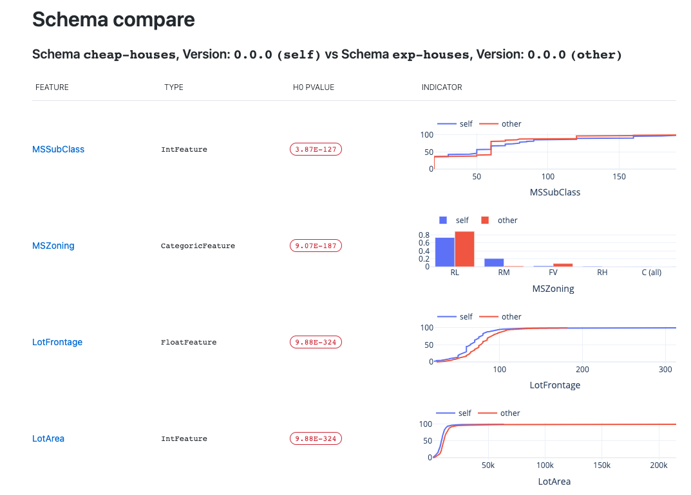

# Raymon Data Validation Library


[](https://github.com/psf/black)
<a href="https://github.com/raymon-ai/data-validation/blob/master/LICENSE.md"></a>
<a href="https://pypi.org/project/rdv/"></a>


## What?
RDV (Raymon Data Validation) is a library to validate data in ML / AI systems. RDV allows you to easily specify data schemas that capture the characteristics of your train data. These schemas can then be used to validate incoming production data and track data and model health metrics.

RDV provides currently offers basic data validation functionality for structured and vision data, but we aim to further extend this functionality to other fields. RDVs current main purpose is to provide users a framework in which they can easily plugin their own functionlaity to integrate with the rest of the Raymon.ai system, but it can be used standalone and is open source.

An overview of available functionality and the roadmap can be found below. Additional features to bo added to the roadmap can be requested in the [issues](https://github.com/raymon-ai/data-validation/issues).

## Why?
As a data scientist or ML engineer, you are responsible for the correctness and reliability of your systems. However, this correctness not only depends on how good you or your team can apply fancy algorithms, but also on the data your system receives from clients, which you may have little control over. Data can be corrupted, input distributions may evolve (data drift) or the relationship between features and targets may have changed (concept drift / covariate shift). 'Bad' data might be processed without raising errors, but the results will be unreliable and less accurate (model degredation). Catching these issues may be hard without the right tooling. RDV basially offers you a framework to easiliy validate your data and predictions so that bad data can be surfaced, owners cna be notified and approriate action can be taken.

## How?

- A schema is composed out of one or multiple features.
- These features are calculated from data by feature extractors. The simplest case is selecting a certain feature from structured data like in the example below, but this can be any feature extractor like an image sharpness, or an outlier score.
- Every schema feature stores a reference to this feature extractor. 
- When building a schema, the specified features are extracted from all data points and statistics about these features (min, max, mean, distribution) are saved .
- The schema can be loaded in production systems to check incoming data.




## Installation 

### Installation
RDV can be installed from PyPI

```bash
pip install rdv
```

## Usage
This section gives a brief overview of how to use RDV. See [the examples](https://github.com/raymon-ai/data-validation/tree/master/examples) and [docs](https://github.com/raymon-ai/data-validation/tree/master/docs) for more info.

### Schema building

Let's take the example of structured data. Creating a schema for a certain dataframe (for example your train or test set) goes as follows:
```python
import pandas as pd
from rdv.schema import Schema
from rdv.feature import construct_features

# Load some data
cheap_data = pd.read_csv("./data_sample/subset-cheap.csv").drop("Id", axis="columns")
# Build a schema
schema = Schema(name="cheap-houses", features=construct_features(cheap_data.dtypes))
schema.build(data=cheap_data)
# Save it
schema.save("schema-cheap.json")
```
### Checking data
Validating a data points goes like this:
```python
schema.check(cheap_data.iloc[0, :])
```
Which will output a list of tags, which can be the feature values or data errors. These tags can be pushed to the Raymon.ai backend, to be used as metrics for monitoring.
```python
[{'type': 'schema-feature',
  'name': 'MSSubClass',
  'value': 70.0,
  'group': 'cheap-houses@0.0.0'},
 {'type': 'schema-feature',
  'name': 'MSZoning',
  'value': 'RL',
  'group': 'cheap-houses@0.0.0'},
  # This is an error: the "Alley" feature is NaN
 {'type': 'schema-error',
  'name': 'Alley-err',
  'value': 'Value NaN',
  'group': 'cheap-houses@0.0.0'},
  ...
]
```

### Viewing schema
Data schemas can be visualized for inspection too:
```python
schema.view()
```
This will open an interactive dash app, looking like this:


### Viewing a specific POI
```python
schema.view(poi=cheap_data.iloc[0, :])

```
This will also open an interactive dash app, looking as follows. Notice the yellow indicators indicating the current poi.


### Comparing schemas
RDV also allows you to compare 2 schemas.

```python
exp_data = pd.read_csv("./data_sample/subset-exp.csv").drop("Id", axis="columns")
schema_exp = Schema(name="exp-houses", features=construct_features(data.dtypes))
schema_exp.build(data=exp_data)

schema.compare(schema_exp)
```


## Available feature extractors

### Structured Data
| Name | Description   |
| ---- | ---- |
| [ElementExtractor](https://github.com/raymon-ai/data-validation/blob/master/rdv/extractors/structured/element.py)   | Simply extracts one element from a feature array. |                                                                                                 |
| [KMeansOutlierScorer](https://github.com/raymon-ai/data-validation/blob/master/rdv/extractors/structured/kmeans.py) | Given an numeric vector, calculates an outlier score based on kmeans clustering of the training data. [Reference](https://arxiv.org/abs/2002.10445) |


### Vision Data
| Name   | Description   |
| ---- | ---- |
| [AvgIntensity](https://github.com/raymon-ai/data-validation/blob/master/rdv/extractors/vision/intensity.py)   | Extracts the average of an input image.  |
| [Sharpness](https://github.com/raymon-ai/data-validation/blob/master/rdv/extractors/vision/sharpness.py)      | Extracts the sharpness of an image.   |
| [FixedSubpatchSimilarity](https://github.com/raymon-ai/data-validation/blob/master/rdv/extractors/vision/similarity.py) | Calculates how similar a fixed part of an image is to a reference. Useful to detect camera shift when a fixed object should always be in view. |
| [DN2OutlierScorer](https://github.com/raymon-ai/data-validation/blob/master/rdv/extractors/vision/dn2.py)   | Given an image, calculates an outlier score based on kmeans clustering of the training data. [Reference](https://arxiv.org/abs/2002.10445) |


## Extractors roadmap
